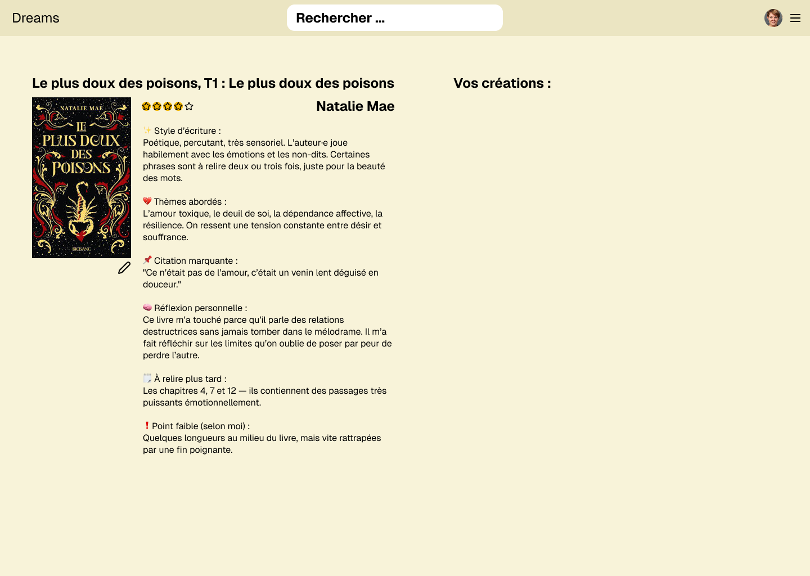

# Dreams - Journal de lecture créatif

## But de l'application
Dreams a pour but d'aider les utilisateurs à tenir un journal de lecture de livres. L'application est destinée à être utilisée par les utilisateurs qui aiment lire et qui aiment réaliser des critiques de livres ou des petits dessins créatifs sur ces livres.

## Explication détaillée de l'application

### Concept général
Dreams est une plateforme communautaire qui combine la passion pour la lecture avec l'expression créative. Elle permet aux utilisateurs de suivre leurs lectures, d'organiser leur pile à lire (PAL), de partager leurs impressions via des critiques textuelles et d'exprimer leur ressenti par des créations artistiques liées aux livres qu'ils ont lus.

### Fonctionnalités principales

#### Pour les utilisateurs standards
- Créer un **compte** utilisateur
- Se **connecter** à son compte
- **Enregistrer un livre** et charger ses infos par **API** (Google Books API)
- Ajouter une **critique** de livre
- Ajouter un **dessin créatif** (potentiellement en utilisant une API de dessin)
- Consulter sa page créative du livre
- Réaliser une **PAL** (pile à lire) qui permet de suivre les livres que l'on souhaite lire
- Consulter la **PAL** des autres utilisateurs
- Consulter les **critiques** des autres utilisateurs
- Consulter les **dessins créatifs** des autres utilisateurs
- Calculer des **statistiques** sur ses lectures (ex: nombre de livres lus, temps passé à lire, etc.)
- Consulter les **statistiques** des autres utilisateurs
- Suivre d'autres utilisateurs et recevoir des notifications de leurs activités

#### Pour les administrateurs
- Gestion des utilisateurs (suspension, suppression, modification des droits)
- Modération des contenus (critiques, dessins inappropriés)
- Gestion du catalogue de livres (correction d'informations erronées)
- Accès aux statistiques globales de la plateforme
- Configuration des paramètres de l'application

### Niveaux de navigation

1. **Navigation publique** (sans connexion)
   - Page d'accueil avec présentation du concept
   - Inscription/Connexion
   - Consultation limitée des livres populaires et critiques récentes
   - Recherche de livres dans le catalogue

2. **Navigation utilisateur** (après connexion)
   - Tableau de bord personnel avec résumé d'activité
   - Gestion de la bibliothèque personnelle (livres lus, en cours, PAL)
   - Création et édition de critiques et dessins
   - Exploration communautaire (découverte d'autres utilisateurs)
   - Page de profil personnalisable

3. **Navigation administrative**
   - Tableau de bord d'administration
   - Gestion des utilisateurs
   - Modération des contenus
   - Statistiques et analyses de la plateforme
   - Paramètres système

## Objectif final de l'application

L'objectif de Dreams est de créer une communauté dynamique où les passionnés de lecture peuvent:
- Organiser efficacement leur activité de lecture et garder trace de leur parcours littéraire
- Exprimer leur créativité à travers différents médiums (texte, dessin) en lien avec leurs lectures
- Découvrir de nouveaux livres grâce aux recommandations de la communauté
- Partager leur passion avec d'autres lecteurs aux intérêts similaires
- Développer leur sensibilité artistique et littéraire

À terme, Dreams aspire à devenir un réseau social de référence pour les lecteurs créatifs.

## Schémas de la base de données

### Entités principales et relations

#### Users (Utilisateurs)
- **user_id**: INT, PK, AUTO_INCREMENT
- **username**: VARCHAR(50), UNIQUE
- **email**: VARCHAR(100), UNIQUE
- **password_hash**: VARCHAR(255)
- **profile_image**: VARCHAR(255)
- **bio**: TEXT
- **created_at**: TIMESTAMP
- **updated_at**: TIMESTAMP
- **role**: ENUM('user', 'admin')
- **status**: ENUM('active', 'suspended', 'deleted')

#### Books (Livres)
- **book_id**: INT, PK, AUTO_INCREMENT
- **google_books_id**: VARCHAR(100), UNIQUE
- **title**: VARCHAR(255)
- **author**: VARCHAR(255)
- **publisher**: VARCHAR(100)
- **published_date**: DATE
- **page_count**: INT
- **description**: TEXT
- **cover_image**: VARCHAR(255)
- **isbn**: VARCHAR(20)
- **created_at**: TIMESTAMP
- **updated_at**: TIMESTAMP

#### UserBooks (Relation Utilisateurs-Livres)
- **user_book_id**: INT, PK, AUTO_INCREMENT
- **user_id**: INT, FK -> Users.user_id
- **book_id**: INT, FK -> Books.book_id
- **status**: ENUM('read', 'reading', 'to_read')
- **start_date**: DATE
- **finish_date**: DATE
- **reading_time**: INT (minutes)
- **created_at**: TIMESTAMP
- **updated_at**: TIMESTAMP

#### Reviews (Notes et critiques)
- **review_id**: INT, PK, AUTO_INCREMENT
- **user_id**: INT, FK -> Users.user_id
- **book_id**: INT, FK -> Books.book_id
- **rating**: TINYINT(1)
- **content**: TEXT
- **visibility**: ENUM('public', 'private')
- **created_at**: TIMESTAMP
- **updated_at**: TIMESTAMP

## Sujet à changer
#### CreativeWorks (Œuvres créatives/Dessins)
- **work_id**: INT, PK, AUTO_INCREMENT
- **user_id**: INT, FK -> Users.user_id
- **book_id**: INT, FK -> Books.book_id
- **title**: VARCHAR(255)
- **description**: TEXT
- **image_path**: VARCHAR(255)
- **visibility**: ENUM('public', 'private')
- **created_at**: TIMESTAMP
- **updated_at**: TIMESTAMP

#### Follows (Abonnements)
- **follow_id**: INT, PK, AUTO_INCREMENT
- **follower_id**: INT, FK -> Users.user_id
- **following_id**: INT, FK -> Users.user_id
- **created_at**: TIMESTAMP

#### Notifications
- **notification_id**: INT, PK, AUTO_INCREMENT
- **user_id**: INT, FK -> Users.user_id
- **type**: ENUM('review', 'creative_work', 'follow', 'system')
- **content**: TEXT
- **related_id**: INT
- **is_read**: BOOLEAN
- **created_at**: TIMESTAMP

## Maquettes
### Page d'accueil (Desktop)

### Page d'ajout d'un livre (Desktop)

### Page de détail d'un livre (Desktop)

## Technologies utilisées
- **Frontend**: Next.js (React) + Tailwind CSS
- **Backend**: Node.js + TypeScript + MySQL
- **API**: Google Books API
- **API de dessin**: (à définir)